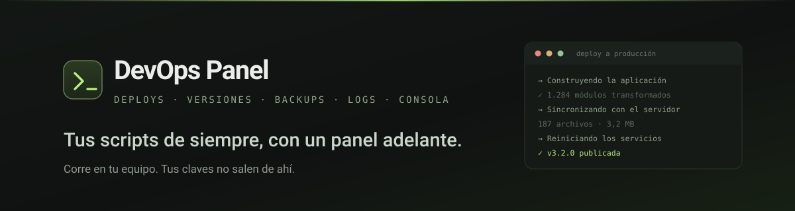
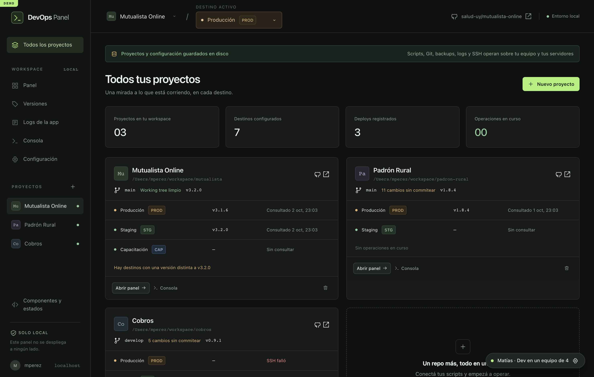
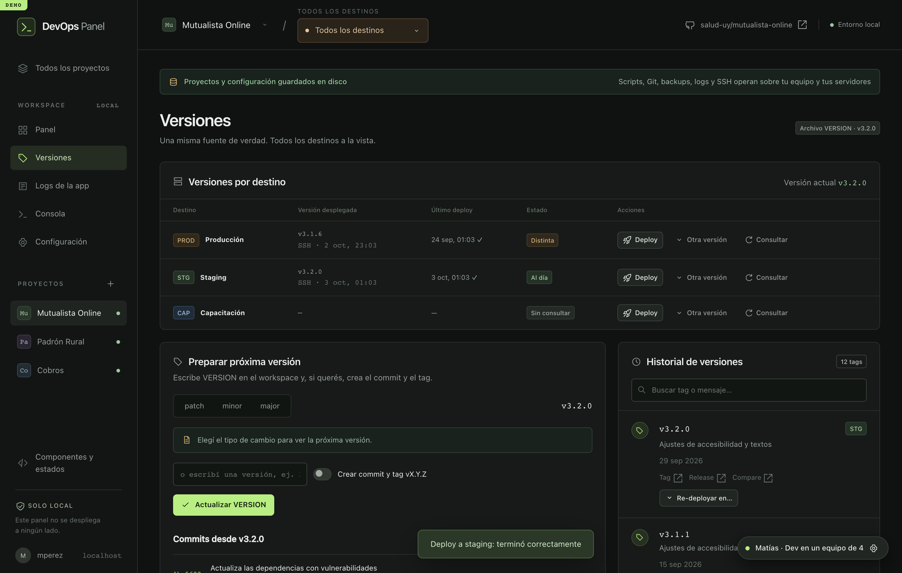
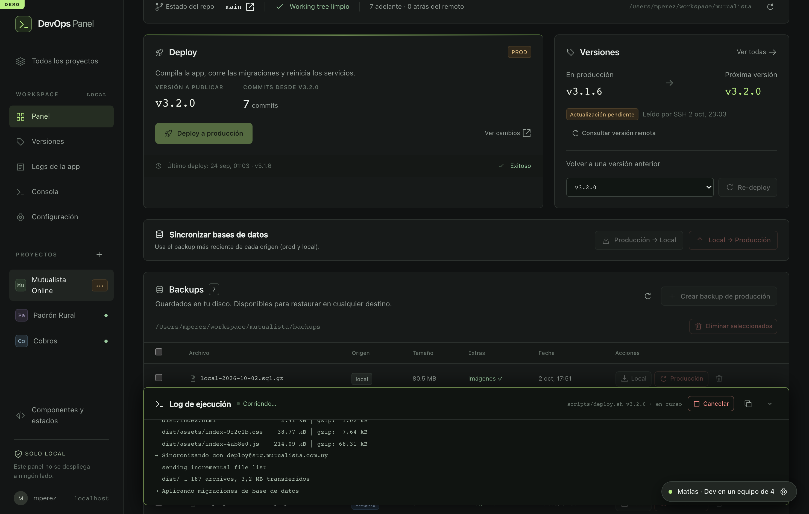
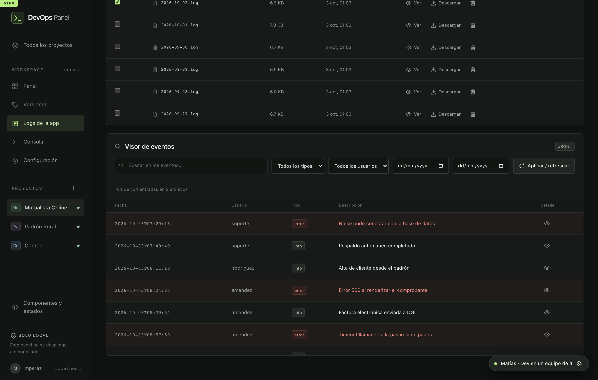
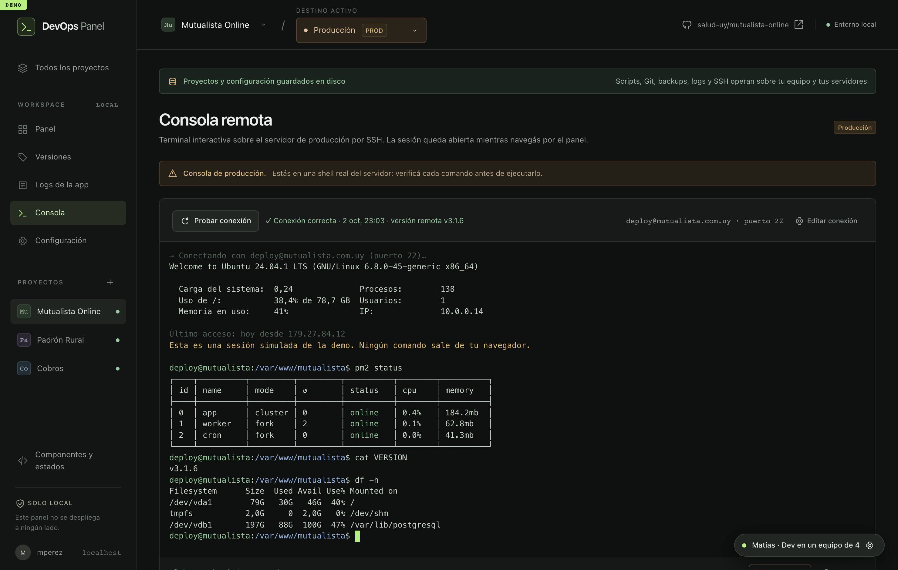
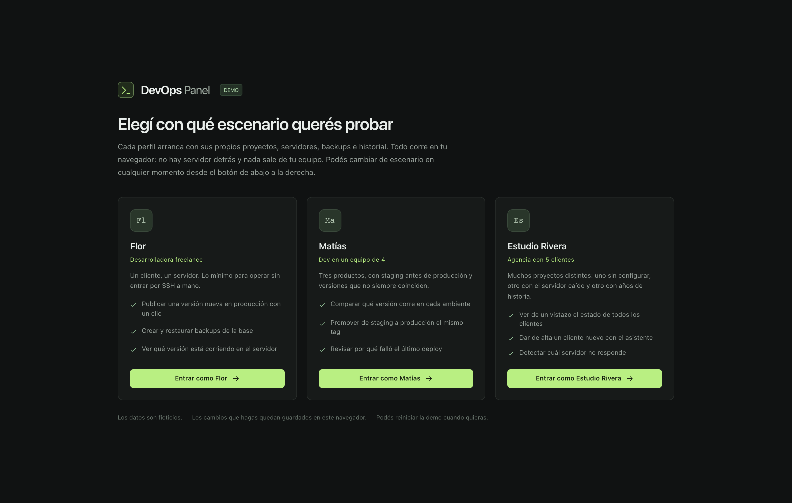

# DevOps Panel

### **Tus scripts de siempre, con un panel adelante.**

Deploys, versiones, backups, logs y consola de tus servidores.
Todo desde un lugar, sin memorizar comandos ni abrir cinco terminales.

 

 

 

## El problema

Tenés los scripts. Funcionan. Pero cada deploy es volver a abrir la terminal, acordarte del host, buscar en qué rama estabas, confirmar que el backup de anoche existe y cruzar los dedos. Y si hay que explicarle el proceso a alguien más, la respuesta es un documento que ya quedó viejo.

**DevOps Panel le pone una cara a lo que ya tenés.** Tus scripts siguen siendo tuyos: el panel los ejecuta, te muestra la salida en vivo y deja registro de qué pasó, cuándo y con qué versión.

 

  
   <em>Todos tus proyectos y el estado real de cada servidor, de un vistazo.</em>

 

## Lo que vas a poder hacer

### 🚀 Publicar sin pensar en el procedimiento

Un botón, una confirmación, y la salida del script en vivo línea por línea. Si algo falla, lo ves en el momento y podés cortar a mitad de camino. Se acabó el "¿habrá terminado?".

### 🏷️ Saber qué versión corre en cada lado

Producción, staging, el ambiente de capacitación. El panel los consulta por SSH y te arma la tabla. Cuando algo no coincide, te lo dice antes de que te enteres por un cliente.

### 💾 Backups que sí sabés usar

Crealos desde el panel, restauralos en local para reproducir un bug, o volvé atrás en producción. El último backup queda protegido para que nadie lo borre de apuro, y restaurar sobre un servidor real te pide escribir una frase a mano.

### 📋 Leer los logs sin entrar al servidor

Traelos con un clic y filtralos por texto, tipo, usuario o fechas. Lo que antes era un `grep` a ciegas sobre SSH ahora es una tabla que podés recorrer y exportar.

### 💻 Una terminal de verdad, cuando hace falta

Porque siempre hace falta. Consola interactiva sobre tus servidores, con `sudo`, autocompletado y editores. La sesión queda abierta mientras navegás por el resto del panel.

### ⚙️ Configurable sin tocar código

Cada proyecto define sus scripts, sus destinos, sus variables de entorno y sus acciones propias. Y si preferís, editás el JSON directo. El explorador te muestra qué scripts hay en tu workspace y cuáles tienen permiso de ejecución.

### 🔒 Todo se queda en tu máquina

No hay servidor, no hay cuenta, no hay nube. El panel corre en tu equipo, tus claves SSH no se copian a ningún lado y la configuración vive en un archivo tuyo.

 

| | |
|:---:|:---:|
|  |  |
| **Qué versión corre en cada destino** | **La salida del script, en vivo** |
|  |  |
| **Los logs, filtrables** | **Consola SSH integrada** |

 

## ¿Para quién es?

| | Perfil | Lo que gana |
|:---:|---|---|
| 🧑‍💻 | **Dev que mantiene sus propios proyectos** | Dejar de depender de la memoria. El deploy, el backup y el rollback quedan a un clic, con el registro de lo que pasó. |
| 👥 | **Equipos chicos con staging** | Una sola fuente de verdad sobre qué versión está dónde. Promover de staging a producción deja de ser una conversación. |
| 🏢 | **Agencias y estudios** | Diez clientes, diez servidores, un solo panel. Entrás, mirás y sabés cuál necesita atención. |
| 🤝 | **El que recién entra al equipo** | Puede operar el día uno sin que nadie le pase claves ni un documento de doce pasos. |

 

## Probalo ahora

No hace falta instalar nada ni crear una cuenta. La demo arranca con proyectos, servidores, backups e historial ya cargados, y podés romper todo lo que quieras: hay un botón para volver a empezar.

 

 

**Elegí con qué escenario querés probarla**

| Escenario | Con qué te encontrás |
|---|---|
| 🌱 **Flor** · desarrolladora freelance | Un cliente, un servidor. Lo mínimo para ver de qué se trata. |
| 🧭 **Matías** · dev en un equipo de 4 | Tres productos con staging, versiones desalineadas y un deploy que falló. |
| 🏢 **Estudio Rivera** · agencia con 5 clientes | Un cliente sin configurar, un servidor caído y otro con años de historia. |

   
  

 

### ¿Te sirve para tu equipo?

Escribinos y lo vemos juntos.

 

**[✉️ Contacto](mailto:hola@devopspanel.uy)** · **[💬 Abrir una conversación](URL_DE_LA_DEMO)**

  

Los datos de la demo son ficticios. Nada de lo que hagas ahí sale de tu navegador.

